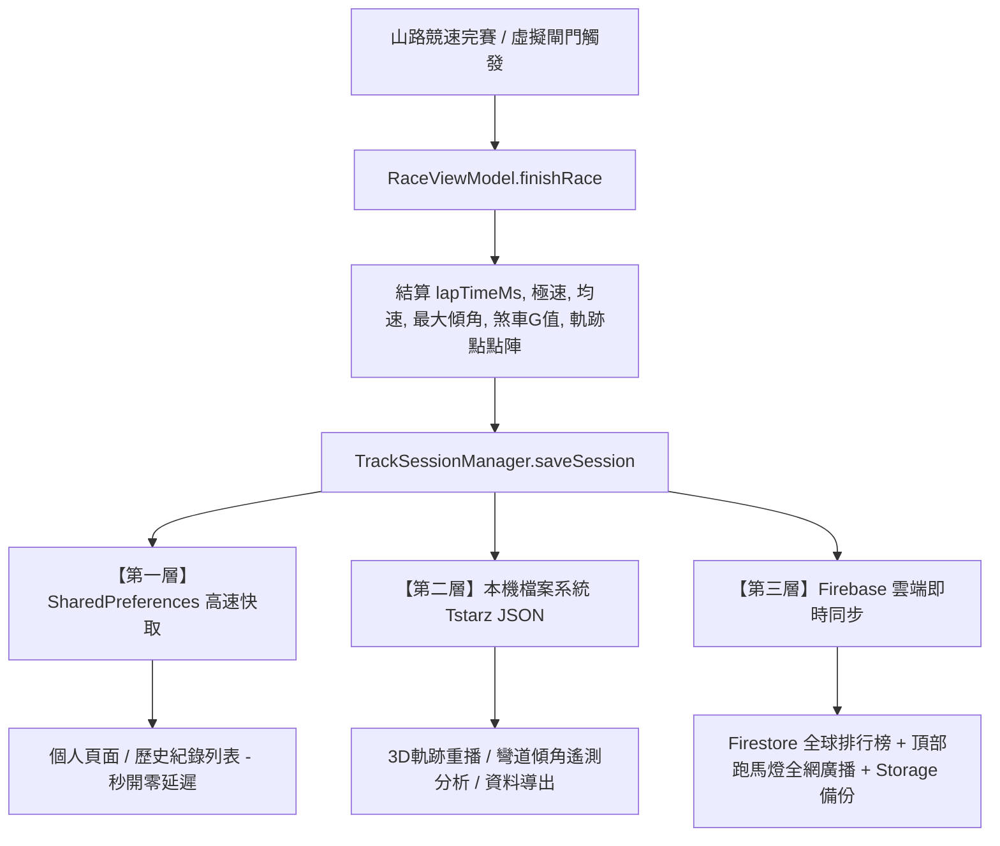

# REV-ON 系統架構：三層式賽道紀錄儲存與同步機制規格書

本文件詳細記載 **REV-ON** 手機 App 在山路競速完賽時的資料處理、本機兩層快取與雲端同步機制規格，供後續功能開發、維護與擴充參考。

---

## 📐 架構總覽 (Architecture Overview)

REV-ON 採用 **三層式混合儲存架構 (Three-Tier Hybrid Storage Architecture)**，兼顧 UI 介面的高速響應（毫秒級讀取）、龐大 GPS 遙測軌跡數據的儲存與導出，以及全網車手即時排行榜與跑馬燈廣播。



---

## 📊 三層儲存機制詳細對比表 (Comparison Matrix)

| 儲存層級 | 第一層：SharedPreferences 高速快取 | 第二層：本機檔案系統 Tstarz JSON | 第三層：Firebase 雲端即時同步 |
| :--- | :--- | :--- | :--- |
| **技術實現** | Android `SharedPreferences`<br>(`revon_sessions_pref.xml`) | 本機檔案系統文件檔<br>(`context.filesDir/track_sessions/`) | Firebase Firestore + Firebase Storage 雲端服務 |
| **主要定位** | UI 列表極速快取 | 完整遙測 (Telemetry) 軌跡檔與外部分析 | 雲端排行榜、全網競速廣播、線上人數 Presence |
| **資料內容** | 精簡概要統計資訊<br>(圈速、極速、均速、傾角、日期) | **數萬點高頻 GPS 遙測數據**<br>(經緯度、海拔、車速、傾角、G值) | 全球車手完賽時間、位次、線上活躍狀態、雲端 Json 下載 URL |
| **單筆檔案大小** | 極小 (~ 1 KB) | 較大 (~ 200 KB 至 5 MB) | 資料庫 Document (~ 500 B) + Storage (~ 200 KB) |
| **讀取速度** | **微秒級 (0.01s)**，啟動直接載入記憶體 | 毫秒級磁碟 I/O，僅查看細節時讀取 | 視網路延遲，支援 Live Stream Real-time Listener |
| **刪除與生命週期**| 隨 App 卸載或清除快取重置 | 隨 App 資料區保留，支援手動刪除單檔 | 永久備份於雲端專屬 Firestore Leaderboards |

---

## 🔍 三層架構詳細說明

### 1. 第一層：本機 SharedPreferences 高速快取
* **儲存路徑**：`revon_sessions_pref.xml`（Key: `saved_sessions_json`）
* **核心目的**：
  - 避免在開啟「個人頁面」或「歷史紀錄」列表時，需要對幾十個大檔案進行硬碟 I/O 解析，解決畫面卡頓。
  - 儲存高層級摘要數據，提供微秒級解碼展現。

### 2. 第二層：本機檔案系統獨立文件檔 (Tstarz 軌跡規格)
* **儲存路徑**：`context.filesDir/track_sessions/賽道_<TrackCode>_<SessionId>.json`
* **核心目的**：
  - 獨立保存完整的 Telemetry 遙測點位（每秒 10~50 點）。
  - 格式標準化，相容 Tstarz 競速軟體與 2D/3D 繪圖分析工具。
  - 獨立性高，使用者可單獨匯出或刪除特定一場比賽紀錄。

### 3. 第三層：Firebase 雲端即時同步 (Cloud Sync & Broadcast)
* **Firestore 集合**：
  - `leaderboards/{trackCode}/records/{sessionId}`：各賽道全球排行榜，依最佳秒數排序。
  - `latest_records/{sessionId}`：用於首頁與路線頁頂部滾動跑馬燈全網快報。
  - `online_presence/{uid}`：真實線上人數與心跳計時（15 分鐘活躍判定）。
* **Storage 儲存庫**：
  - `race_records/{sessionId}.json`：備份全量軌跡點 Json 檔。

---

## 📄 資料結構規格 (Data Schemas)

### 1. RaceSessionRecord (核心 Session 摘要模型)
```kotlin
data class RaceSessionRecord(
    val sessionId: String,       // 存檔 ID (例: "sess_1787884800000")
    val trackCode: String,       // 賽道代號 (例: "136", "T21", "谷關")
    val trackName: String,       // 賽道名稱 (例: "136 縣道", "新中橫 · 阿里山")
    val playerNickname: String,  // 車手暱稱 (例: "LOVE888345")
    val vehicleType: String,     // 車種 ("MOTOR" / "CAR" / "OTHER")
    val lapTimeMs: Long,         // 完賽總時間毫秒數 (例: 255820)
    val lapTimeDisplay: String,  // 時間字串 (例: "04:15.82")
    val maxSpeedKmh: Float,      // 極速 (km/h)
    val avgSpeedKmh: Float,      // 均速 (km/h)
    val maxLeanAngle: Float,     // 最大車身傾角 (度)
    val maxBrakingG: Float,      // 最大煞車 G 值
    val pointsEarned: Int,       // 獲得 R 點數 (例: 350)
    val recordedAt: String,      // 紀錄時間 (例: "2026-09-03 18:04")
    val pointsList: List<TrackPoint> // 詳細軌跡點位陣列
)
```

### 2. TrackPoint (遙測點位模型)
```kotlin
data class TrackPoint(
    val latitude: Double,    // 緯度 (WGS84)
    val longitude: Double,   // 經度 (WGS84)
    val altitude: Double,    // 海拔高度 (m)
    val speedKmh: Float,     // 即時車速 (km/h)
    val timestampMs: Long,   // 採樣時間戳
    val leanAngle: Float,    // 即時車身左右傾角 (度)
    val accelG: Float,       // 即時前後加速度 / 煞車 G 值
    val latG: Float          // 即時側向 G 值
)
```

### 3. Tstarz 匯出 JSON 格式範例
```json
{
  "header": {
    "type": "session",
    "trackName": "136 縣道",
    "recordId": "sess_1787884800000",
    "recordedAt": "2026-09-03 18:04",
    "lapTimeMs": 255820
  },
  "points": [
    {
      "lt": 24.123456,
      "lg": 120.789012,
      "s": 78.5,
      "t": 1787884800100,
      "l": 32.4,
      "g": -0.65
    }
  ]
}
```

---

## 🛠️ 後續開發者指引 (Developer Integration Guide)

1. **取得完賽紀錄列表（UI 渲染）**：
   直接呼叫 `TrackSessionManager.getAllSessions(context)`，它會自動將用戶儲存紀錄與內建 35 筆 Tstarz 備份自動整合並按毫秒時間排序。
2. **新增完賽紀錄**：
   使用 `RaceViewModel.finishRace(nickname)` 或 `TrackSessionManager.saveSession(context, record)`，即會自動非同步完成三層儲存與 Firebase 廣播。
3. **刪除紀錄**：
   呼叫 `TrackSessionManager.deleteSession(context, sessionId)`，系統將同步從 SharedPreferences 移除並清理實體檔案。
